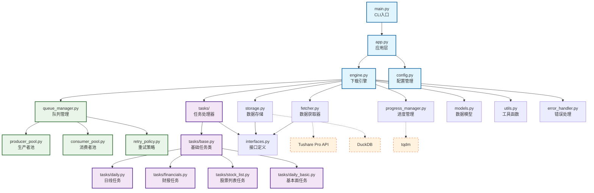

# 模块依赖图

这是 Stock Downloader 项目的模块依赖关系图，展示了核心模块间的依赖关系。

## 整体架构图

## 核心模块详解

### 入口层 (Entry Layer)
- **`main.py`**: CLI 入口，负责参数解析，立即移交控制权
- **`app.py`**: 应用层，协调各个组件的初始化

### 控制层 (Control Layer)  
- **`engine.py`**: 下载引擎，核心控制器，协调所有下载活动
- **`config.py`**: 配置管理器，读取和验证 YAML 配置

### 数据层 (Data Layer)
- **`fetcher.py`**: 数据获取器，封装 Tushare Pro API 调用
- **`storage.py`**: 数据存储器，处理 DuckDB 数据库操作

### 任务层 (Task Layer)
- **`tasks/base.py`**: 基础任务类，定义任务处理的统一接口
- **`tasks/daily.py`**: 日线数据任务处理器
- **`tasks/financials.py`**: 财务报表任务处理器  
- **`tasks/stock_list.py`**: 股票列表任务处理器
- **`tasks/daily_basic.py`**: 基本面数据任务处理器

### 队列层 (Queue Layer)
- **`queue_manager.py`**: 队列管理器，协调生产者和消费者
- **`producer_pool.py`**: 生产者池，生成下载任务
- **`consumer_pool.py`**: 消费者池，执行下载任务
- **`retry_policy.py`**: 重试策略，处理失败任务的重试逻辑

### 支持层 (Support Layer)
- **`progress_manager.py`**: 进度管理器，实时显示下载进度
- **`models.py`**: 数据模型定义
- **`interfaces.py`**: 接口和抽象类定义
- **`utils.py`**: 工具函数集合
- **`error_handler.py`**: 错误处理器

## 数据流向

```mermaid
flowchart LR
    USER[用户命令] --> CLI[main.py]
    CLI --> APP[app.py]
    APP --> ENGINE[engine.py]
    
    ENGINE --> QUEUE[queue_manager.py]
    QUEUE --> PRODUCER[producer_pool.py]
    PRODUCER --> TASKS[tasks/]
    TASKS --> FETCHER[fetcher.py]
    FETCHER --> TUSHARE[Tushare API]
    
    TUSHARE --> DATA[原始数据]
    DATA --> CONSUMER[consumer_pool.py]
    CONSUMER --> STORAGE[storage.py]
    STORAGE --> DUCKDB[DuckDB]
    
    ENGINE --> PROGRESS[progress_manager.py]
    PROGRESS --> TERMINAL[终端进度条]
    
    classDef userLayer fill:#e3f2fd,stroke:#0d47a1
    classDef coreLayer fill:#e8f5e8,stroke:#2e7d32  
    classDef dataLayer fill:#fff3e0,stroke:#f57c00
    
    class USER,CLI userLayer
    class APP,ENGINE,QUEUE,PRODUCER,CONSUMER,TASKS coreLayer
    class FETCHER,STORAGE,TUSHARE,DUCKDB,DATA dataLayer
```

## 关键设计原则

1. **职责分离**: 每个模块都有明确的职责边界
2. **插件化**: 任务处理器通过 entry-points 机制动态加载
3. **异步解耦**: 生产者-消费者模式实现异步处理
4. **接口驱动**: 通过接口定义模块间的契约
5. **配置驱动**: 通过 YAML 配置文件控制行为

## 已移除模块

在代码清理过程中，以下模块已被安全删除：

- **`enhanced_queue_manager.py`** - 0% 覆盖率的队列管理器增强版本
- **`dead_letter_csv.py`** - 无运行时引用的死信CSV处理模块  
- **`scripts/find_unused.py`** - 完成使命的分析脚本
- **重复的 `category_service.py`** - 与现有文件重复
- **空的 `__init__.py`** 文件 - 简化包结构

这些删除操作确保了代码库的精简性，同时保持 100% 功能完整性。

## 扩展指南

要添加新的任务处理器：

1. 在 `tasks/` 目录创建新的处理器文件
2. 继承 `BaseTaskHandler` 类
3. 在 `pyproject.toml` 中注册 entry-point
4. 在 `config.yaml` 中添加任务配置

项目的模块化设计使得扩展新功能变得简单而安全。
