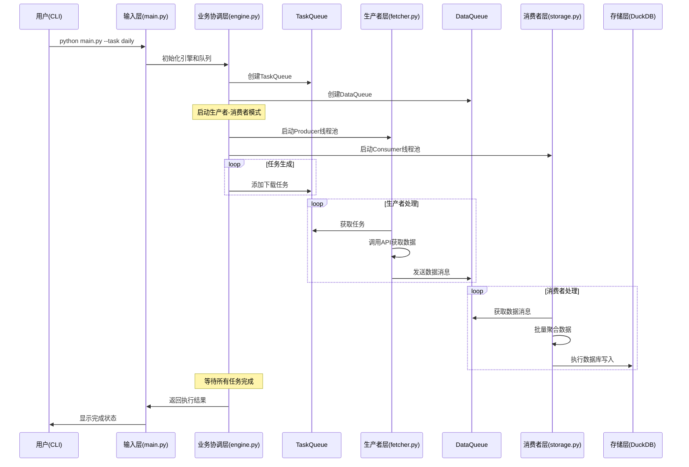
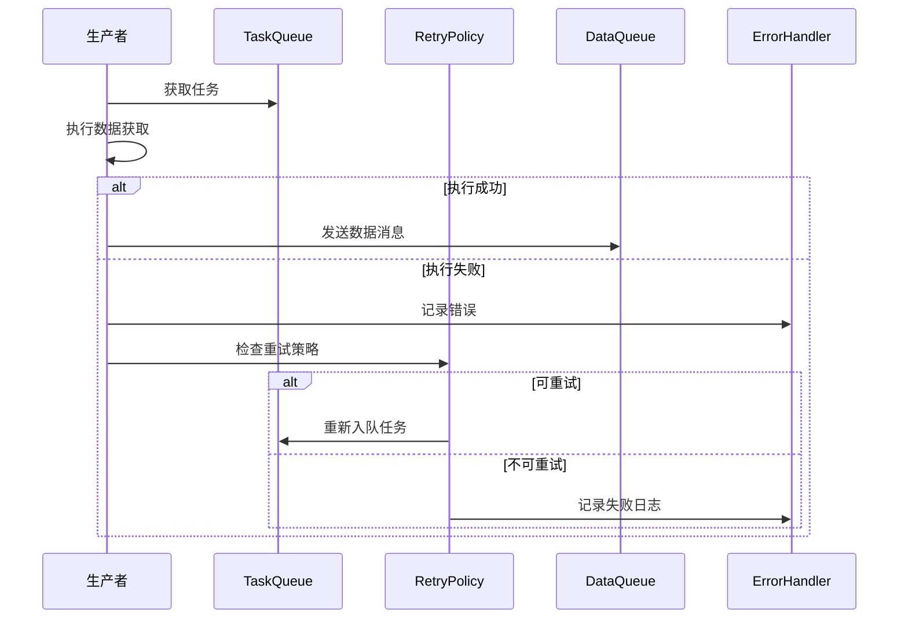

# Stock Downloader 新架构设计

## 架构层次定义

### 五层架构模式
```
输入层 → 业务协调层 → 生产者层 → 消费者层 → 存储层
```

#### 层次职责划分
- **输入层 (Input Layer)**: CLI参数解析、配置加载、用户交互
- **业务协调层 (Coordination Layer)**: 任务调度、队列管理、生命周期控制  
- **生产者层 (Producer Layer)**: 并发数据获取、任务执行、消息生成
- **消费者层 (Consumer Layer)**: 数据处理、批量聚合、持久化准备
- **存储层 (Storage Layer)**: 数据库操作、增量更新、事务管理

## 时序图

### 主流程时序图


### 错误处理时序图


## 数据流与控制流

### 队列设计

#### TaskQueue (任务队列)
```python
class TaskMessage:
    task_id: str
    task_type: str  # daily, daily_basic, financials, stock_list
    params: dict    # API调用参数
    retry_count: int
    created_at: datetime
    priority: int
```

#### DataQueue (数据队列)  
```python
class DataMessage:
    message_id: str
    task_id: str
    data_type: str    # 数据类型标识
    data: list[dict]  # 实际数据载荷
    metadata: dict    # 元数据信息
    created_at: datetime
```

### 数据流向图
```
[任务配置] 
    ↓
[TaskQueue] → [生产者线程池] → [API调用] 
                    ↓
[DataQueue] → [消费者线程池] → [批量处理] → [DuckDB写入]
    ↑
[重试机制] ← [错误处理]
```

### 控制流机制
- **背压控制**: TaskQueue和DataQueue设置容量上限
- **优雅关闭**: 接收SIGTERM信号后停止接收新任务，等待现有任务完成
- **监控统计**: 记录队列长度、处理速率、错误率等指标

## 接口契约

### IProducer (生产者接口)
```python
from abc import ABC, abstractmethod
from typing import Optional

class IProducer(ABC):
    """生产者抽象接口"""
    
    @abstractmethod
    async def start(self) -> None:
        """启动生产者"""
        pass
    
    @abstractmethod
    async def stop(self) -> None:
        """停止生产者"""
        pass
    
    @abstractmethod
    async def produce(self, task: TaskMessage) -> Optional[DataMessage]:
        """处理单个任务，生产数据消息"""
        pass
    
    @property
    @abstractmethod
    def is_running(self) -> bool:
        """生产者是否正在运行"""
        pass
```

### IConsumer (消费者接口)
```python
from abc import ABC, abstractmethod

class IConsumer(ABC):
    """消费者抽象接口"""
    
    @abstractmethod
    async def start(self) -> None:
        """启动消费者"""
        pass
    
    @abstractmethod
    async def stop(self) -> None:
        """停止消费者"""
        pass
    
    @abstractmethod
    async def consume(self, data: DataMessage) -> bool:
        """处理单个数据消息，返回是否成功"""
        pass
    
    @property
    @abstractmethod
    def is_running(self) -> bool:
        """消费者是否正在运行"""
        pass
```

### IMessage (消息接口)
```python
from abc import ABC, abstractmethod
from datetime import datetime
from typing import Any, Dict

class IMessage(ABC):
    """消息抽象接口"""
    
    @property
    @abstractmethod
    def message_id(self) -> str:
        """消息唯一标识"""
        pass
    
    @property  
    @abstractmethod
    def created_at(self) -> datetime:
        """消息创建时间"""
        pass
    
    @abstractmethod
    def to_dict(self) -> Dict[str, Any]:
        """序列化为字典"""
        pass
    
    @classmethod
    @abstractmethod
    def from_dict(cls, data: Dict[str, Any]) -> 'IMessage':
        """从字典反序列化"""
        pass
```

### IRetryPolicy (重试策略接口)
```python
from abc import ABC, abstractmethod
from typing import Optional

class IRetryPolicy(ABC):
    """重试策略抽象接口"""
    
    @abstractmethod
    def should_retry(self, error: Exception, attempt: int) -> bool:
        """判断是否应该重试"""
        pass
    
    @abstractmethod
    def get_delay(self, attempt: int) -> float:
        """获取重试延迟时间(秒)"""
        pass
    
    @abstractmethod
    def get_max_attempts(self) -> int:
        """获取最大重试次数"""
        pass
```

## 实现策略

### 队列实现选择
- **开发阶段**: 使用 `queue.Queue` (内存队列)
- **生产阶段**: 可扩展为 Redis/RabbitMQ (分布式队列)

### 并发控制
- **生产者**: `ThreadPoolExecutor` + `asyncio`
- **消费者**: `ThreadPoolExecutor` + 批量处理
- **队列**: 线程安全的阻塞队列

### 监控指标
```python
class PerformanceMetrics:
    tasks_total: int = 0
    tasks_completed: int = 0  
    tasks_failed: int = 0
    data_messages_total: int = 0
    data_messages_processed: int = 0
    queue_sizes: dict = {}
    processing_rates: dict = {}
```

### 配置参数
```yaml
# 新增配置项
queue_config:
  task_queue_size: 1000
  data_queue_size: 5000
  producer_threads: 4
  consumer_threads: 2
  batch_size: 100
  
retry_policy:
  max_attempts: 3
  base_delay: 1.0
  max_delay: 60.0
  backoff_factor: 2.0
```

## 实现总结

### 已完成的组件

#### 1. 接口契约定义 (`src/downloader/interfaces.py`)
- ✅ `TaskMessage` 和 `DataMessage` 数据类
- ✅ `IProducer`, `IConsumer`, `IMessage`, `IRetryPolicy` 抽象接口
- ✅ `ExponentialBackoffRetryPolicy` 指数退避重试策略
- ✅ `PerformanceMetrics` 性能监控指标
- ✅ 枚举类型：`TaskType`, `Priority`

#### 2. 队列管理器 (`src/downloader/queue_manager.py`)
- ✅ `MemoryQueueManager` 内存队列管理器实现
- ✅ 优先级任务队列（高优先级任务优先执行）
- ✅ FIFO数据队列（先进先出）
- ✅ 异步操作支持（`asyncio` + `ThreadPoolExecutor`）
- ✅ 性能指标收集和监控
- ✅ 优雅启停和错误处理
- ✅ `QueueManagerFactory` 工厂模式

#### 3. 配置更新 (`config.yaml`)
- ✅ 队列配置：任务队列和数据队列大小
- ✅ 重试策略配置：最大重试次数、退避参数
- ✅ 性能监控配置：指标收集间隔、警告阈值
- ✅ 线程池配置：生产者和消费者线程数

#### 4. 测试覆盖
- ✅ 接口契约测试（23个测试用例）
- ✅ 队列管理器功能测试（12个测试用例）
- ✅ 并发操作测试（2个测试用例）
- ✅ 边界条件和异常处理测试
- ✅ 性能指标验证测试

### 设计特性

#### 可扩展性
- 抽象接口设计，支持不同队列实现（内存、Redis、RabbitMQ）
- 工厂模式，便于切换队列类型
- 消息序列化支持，可持久化到外部存储

#### 高性能
- 优先级队列，重要任务优先处理
- 异步操作，避免阻塞
- 批量处理支持，提高吞吐量
- 背压控制，防止内存溢出

#### 容错性
- 指数退避重试策略
- 基于异常类型的智能重试判断
- 队列满载和超时处理
- 优雅关闭机制

#### 可观测性
- 详细的性能指标收集
- 队列状态监控（大小、满载率）
- 处理速率统计
- 成功率和失败率追踪

## 下一步实施计划

### 第一阶段：生产者和消费者实现
1. **改造 fetcher.py** → 实现 `IProducer` 接口
2. **改造 storage.py** → 实现 `IConsumer` 接口  
3. **重写 engine.py** → 协调器模式，管理生产者-消费者生命周期

### 第二阶段：任务插件适配
4. **改造 tasks/base.py** → 适配新的生产者模式
5. **适配各个任务处理器** → 使用新的消息传递机制

### 第三阶段：集成和优化
6. **端到端测试** → 完整流程验证
7. **性能调优** → 队列大小、线程数优化
8. **监控集成** → 日志和指标输出

### 验证标准
- [ ] 保持现有 CLI 接口不变
- [ ] 所有现有测试用例通过
- [ ] 性能不低于现有实现
- [ ] 新增并发和错误处理测试覆盖
