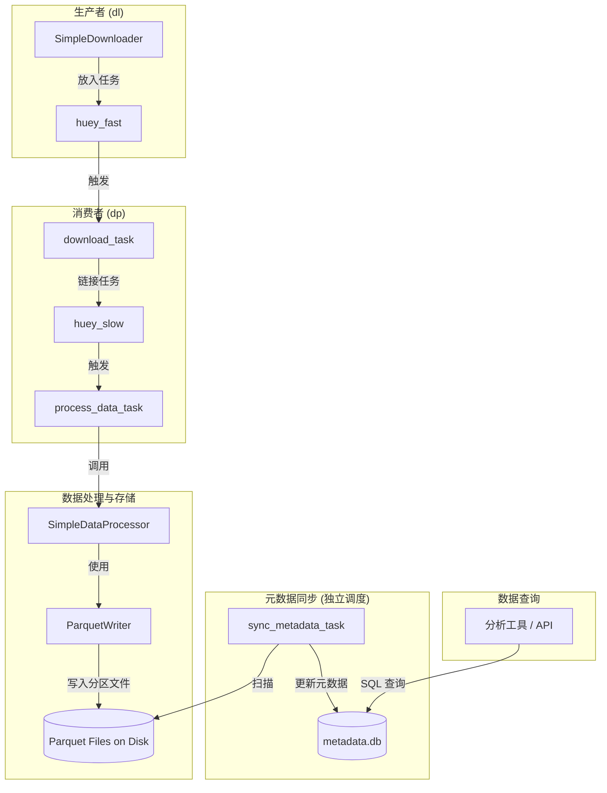

### **技术演进方案：从多队列架构到 Parquet 数据湖**

#### 1. 现状与目标

-   **当前状态 (As-Is)**:
    1.  我们拥有一个高效的双队列系统，将高并发的下载任务 (`fast-queue`) 与单线程的数据库写入任务 (`slow-queue`) 成功隔离。
    2.  性能瓶颈被有效控制在 `slow-queue`，保证了数据获取的最大化吞吐。
    3.  所有数据最终被写入一个（或多个）单体的 DuckDB 数据库文件 (`.db`) 中，数据与元数据高度耦合。

-   **演进目标 (To-Be)**:
    1.  实现计算与存储的彻底分离。
    2.  数据处理的最终产物不再是写入数据库，而是生成**分区化的 Parquet 文件**。
    3.  DuckDB 的角色从“数据容器”转变为纯粹的“**查询引擎**”，其 `.db` 文件仅作为**元数据中心**，存储指向 Parquet 文件的“虚拟表”。
    4.  实现写入操作的完全并行化，为未来更高的性能扩展和更灵活的数据分析奠定基础。

#### 2. 核心改造理念

本次演进的核心，是将 `slow-queue` 的任务目标从 **"加载数据到数据库"** 变为 **"生成标准数据文件"**。

1.  **写入端改造**: `SimpleDataProcessor` 的职责不再是调用 `DBOperator.upsert`，而是调用一个新的 `ParquetWriter` 来将 DataFrame 数据写入到磁盘的指定分区目录。
2.  **引入元数据同步**: 必须建立一个独立的、自动化的机制，来告知 DuckDB 元数据中心哪些新的 Parquet 文件已经可用，并更新其内部的表定义。
3.  **查询端保持稳定**: 对下游的数据消费者（如分析脚本、API服务）来说，查询体验应保持不变。他们依旧连接 `.db` 文件，使用标准 SQL 进行查询，无需关心底层数据是存储在库内还是在外部 Parquet 文件中。

#### 3. 详细实施步骤

##### **阶段一：改造写入端 (Refactor the Write Path)**

1.  **创建 `ParquetWriter` 组件**:
    -   在 `src/neo/` 下创建一个新的模块，例如 `storage/` 或 `writers/`。
    -   实现一个 `ParquetWriter` 类，其核心方法 `write(data: pd.DataFrame, task_type: str)` 接收数据和任务类型。
    -   该方法内部使用 `pyarrow.parquet` 库，根据 `task_type` 和数据内容（如日期字段）生成分区路径（例如：`data/parquet/stock_daily/trade_date=20250826/`），并将 DataFrame 写入该路径下的 Parquet 文件。
    -   在 `AppContainer` 中注册这个新的 `ParquetWriter`。

2.  **修改 `SimpleDataProcessor`**:
    -   从 `SimpleDataProcessor` 的构造函数和 `process` 方法中**移除 `DBOperator` 的依赖**。
    -   注入新的 `ParquetWriter` 依赖。
    -   修改 `process` 方法的逻辑，在数据清洗转换后，调用 `self.parquet_writer.write(data, task_type)`。
    -   此时，`DBOperator` 在数据处理流程中被彻底弃用。

##### **阶段二：建立元数据同步机制 (Establish Metadata Sync)**

这是本次演进最关键的新增部分。

1.  **创建元数据同步任务**:
    -   在 `src/neo/tasks/huey_tasks.py` 中，创建一个新的任务，例如 `sync_metadata_task`。
    -   **推荐**: 为这个任务创建一个全新的、非常低频的 Huey 实例（例如 `huey_maint`，维护队列），或者使用系统级的 `cron` 定时任务来触发一个独立的 Python 脚本。这可以避免与主数据流混淆。
    -   此任务的核心逻辑是：
        ```python
        import duckdb
        
        # 连接到元数据数据库
        con = duckdb.connect('data/metadata.db')
        
        # 使用 DuckDB 的能力扫描并创建/替换表
        # DuckDB 会自动处理分区和数据类型推断
        sql = """
        CREATE OR REPLACE TABLE stock_daily AS
        SELECT * FROM read_parquet('data/parquet/stock_daily/**/*.parquet', hive_partitioning=1);
        """
        con.execute(sql)
        
        # ... 为其他数据类型重复此操作 ...
        
        con.close()
        ```

2.  **调度同步任务**:
    -   配置 `huey_maint` 消费者或 `cron` 任务，根据业务需求以固定频率（例如，每10分钟或每小时）执行一次 `sync_metadata_task`。

##### **阶段三：适配查询端与验证 (Adapt Query Side & Verify)**

1.  **更新查询入口**:
    -   所有需要查询数据的脚本或应用，现在应统一连接到元数据文件 `data/metadata.db`。
    -   执行标准的 SQL 查询，例如 `SELECT * FROM stock_daily WHERE ts_code = '000001.SZ' LIMIT 10;`。DuckDB 会透明地在后台完成对 Parquet 文件的查询。

2.  **数据一致性验证**:
    -   在演进完成后，运行一个对比脚本。同时连接旧的主数据库和新的元数据中心。
    -   对相同的表执行相同的聚合查询（如 `COUNT(*)`, `SUM(amount)`），验证结果是否完全一致，确保迁移过程无数据丢失或损坏。

#### 4. 演进后的架构图



#### 5. 收益总结

完成本次演进后，系统将获得：

-   **极致的写入性能**: 数据写入变成了无锁的文件写入操作，可以被 `slow-queue` 的多个 `worker` 并行执行（如果需要），彻底消除写入瓶颈。
-   **开放的生态系统**: Parquet 是数据科学和大数据领域的标准格式，可以被 Spark, Dask, Pandas, Polars 等几乎所有主流分析工具直接读取，极大地方便了后续的数据探索和分析。
-   **更低的存储成本**: Parquet 的列式存储和高效压缩通常会比传统数据库占用更少的磁盘空间。
-   **清晰的架构权责**: 数据处理团队专注于生成高质量的、标准化的 Parquet 数据集。数据分析团队则面向稳定、高效的 DuckDB 元数据中心进行查询。权责分离，互不干扰。
