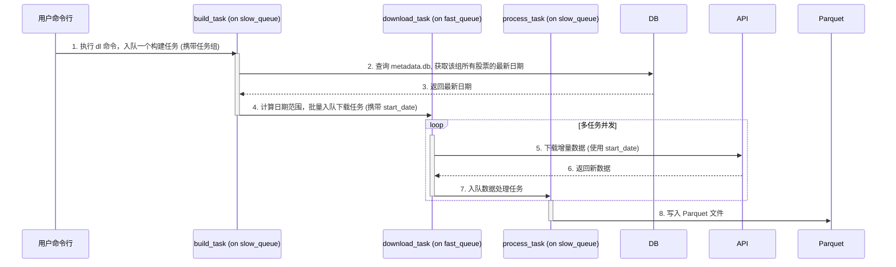

# 技术演进方案：智能增量下载

## 1. 目标与核心思想

在当前架构中，`dl` 命令会下载一个股票的全部历史数据，这在日常更新时会造成大量的 API 资源浪费和不必要的重复处理。我们期望系统能足够智能，每次运行时，**自动检查本地已有数据的最新日期，并仅下载此日期之后的新增数据**。

基于此，我们提出对当前架构的再升级，其核心思想是：

1.  **查询与下载分离**: 将“查询最新日期”这个前置操作，从每个下载任务中剥离出来，在所有下载开始前，进行一次批量的集中查询。
2.  **任务构建任务化**: 将“查询、计算、构建下载任务”这个过程本身，也封装成一个异步的初始任务。用户只需触发这个初始任务，后续的所有流程都将自动在后台异步完成。

## 2. 新的三阶段管道架构

我们将引入一个新的初始任务 `build_and_enqueue_task`，形成一个三阶段的异步处理流水线：



- **独立的元数据同步**: `maint` 队列的消费者仍在后台独立运行，定期将新写入的 Parquet 文件同步到 `metadata.db` 中。

## 3. 具体实施路径

#### 第 1 步: 创建 `build_and_enqueue_task`

这是新增的核心任务，定义在 `src/neo/tasks/huey_tasks.py` 中，并由 `slow_queue` 执行。

- **输入**: 任务组名 (e.g., `'all'`)。
- **逻辑**:
  1.  接收任务组名，通过 `GroupHandler` 解析出该组包含的所有 `symbols` 和 `task_types`。
  2.  连接到 `metadata.db`。
  3.  对每一个 `task_type`（即每一张表），执行一次 SQL 查询，一次性获取该组**所有**股票在这张表里的最新日期。例如：
      ```python
      operator.get_max_date(task_type, symbols)
      ```
  4.  将查询结果存入一个字典，结构为 `{(symbol, task_type): max_date}`。
  5.  循环遍历任务组中的 `symbols` 和 `task_types`，对于每一个组合：
      - 从字典中查找其 `max_date`。
      - 计算出 `start_date`（通常是 `max_date` 的后一天）。如果字典中没有记录（说明是新股票），则使用一个很早的默认起始日期（如 `19900101`）。
      - 调用 `download_task(...)`，将 `symbol`, `task_type`, 和计算出的 `start_date` 作为参数，放入 `fast_queue`。

#### 第 2 步: 改造 `download_task`

- 修改 `download_task` 函数的签名，- `def download_task(task_type: TaskType, symbol: str, **kwargs)`，方便后续改造
- 将这个 `start_date` 传递给 `downloader.download` 方法。
- 从 `kwargs` 中提取 `start_date`。

#### 第 3 步: 改造下载服务层

- 修改 ` SimpleDownloader`的`download ` 方法，使其能够接收并处理 `start_date` 参数，处理方法同上
- 在最终的 Tushare API 调用中，将 `start_date` 应用到其接口参数上，实现只拉取增量数据。

#### 第 4 步: 改造 `dl` 命令行入口

- 修改 `src/neo/main.py` 中的 `dl` 命令。
- 它的职责被极大简化：不再需要自己构建完整的任务列表，而是**只负责将一个 `build_and_enqueue_task` 放入 `slow_queue`**。
- 用户的体验变为：执行 `dl` 命令，命令瞬间完成，所有复杂的查询、计算和大规模下载分派都在后台自动依次进行。

## 4. 优势与影响

- **极致效率**: API 调用和数据处理量都将降到最低，只处理每天的增量数据，极大提升日常运行效率。
- **完全自动化**: 系统实现了“自我认知”。用户不再需要关心从哪天开始下载，只需简单地执行 `dl` 命令，系统会自动填补自上次成功运行以来的所有数据。
- **架构优雅**: 整个流程变成了清晰的、可扩展的三阶段流水线，职责分离，高度解耦。
- **维护简便**: 数据回补（Backfilling）变得简单。如果需要重新下载某只股票的数据，只需在 Parquet 目录中删除它的相关文件，下次运行时，系统会自动发现该股票没有最新日期，从而下载其全部历史数据，实现了“幂等性”和自我修复。
