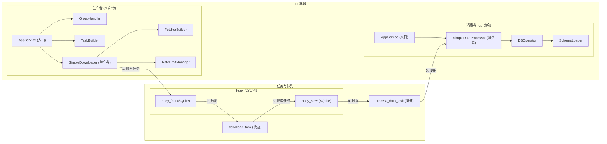

# 核心架构分析

本文档详细描述了 `stock_downloader` 项目在经过**多队列优化**后的核心架构、主要组件及其交互方式。

## 1. 架构风格

本项目采用了两种核心架构风格的组合：

1.  **依赖注入 (Dependency Injection, DI)**: 通过 `dependency-injector` 库实现，遵循**控制反转 (Inversion of Control, IoC)** 原则。
    - **中心化容器**: 应用的核心是 `AppContainer` (`src/neo/containers.py`)，它负责实例化和管理所有服务的生命周期。
    - **松耦合**: 组件不直接创建依赖，而是由容器注入。这使得代码更易于测试、维护和扩展。

2.  **生产者-消费者模式 (Producer-Consumer)**: 项目通过**隔离的任务队列 (Task Queue)** 将下载流程（生产者）与数据处理流程（消费者）完全解耦，解决了原有的性能瓶颈。
    - **双队列隔离**: 系统采用两个独立的 Huey 实例，将任务隔离执行：
        - **`huey_fast` (快速队列)**: 用于处理高并发、耗时短的I/O密集型任务（如API数据下载），配置大量 `workers` 以最大化吞吐量。
        - **`huey_slow` (慢速队列)**: 用于处理耗时长、有阻塞的磁盘I/O任务（如数据库写入），配置为**单 `worker`** 运行，以避免并发写入冲突。
    - **异步处理**: 下载器 (`dl` 命令) 作为生产者，将下载任务放入**快速队列**。任务完成后，再将后续的数据处理任务推入**慢速队列**。
    - **可靠性与扩展性**: 任务队列提高了系统的可靠性。通过隔离快慢任务，系统整体性能不再受限于最慢的环节（数据库写入），获得了显著的性能提升。

## 2. 核心组件详解

### 组件职责列表

-   **`AppContainer` (Container)**: **DI容器**，定义并管理所有应用服务的生命周期和依赖关系。
-   **Huey (双实例, Framework)**: **任务队列中间件**。`huey_fast` 和 `huey_slow` 两个实例，分别管理下载和数据处理任务，实现快慢任务的隔离。
-   **`FetcherBuilder` (Factory)**: **数据获取器工厂**，根据任务类型创建对应的数据获取器 (Fetcher)，负责从外部API抓取数据。
-   **`RateLimitManager` (Singleton)**: **速率管理器**，全局单例，对API请求进行速率限制。
-   **`SimpleDownloader` (Singleton)**: **核心下载器 (生产者)**，协调下载流程，使用 `FetcherBuilder` 获取数据，并将下载任务（`download_task`）放入**快速队列**。不再依赖数据库。
-   **`download_task` (Huey Task)**: **下载任务 (快速)**，在 `huey_fast` 中高并发执行。负责从API下载原始数据，完成后调用 `process_data_task` 将数据送入慢速队列。
-   **`process_data_task` (Huey Task)**: **数据处理任务 (慢速)**，在 `huey_slow` 中**单线程**执行。它会调用 `SimpleDataProcessor` 来完成具体的数据处理和存储。
-   **`SimpleDataProcessor` (Factory)**: **数据处理器 (消费者)**，在后台任务中运行，对原始数据进行清洗、转换，并最终通过 `DBOperator` 存入数据库。其本身是同步实现。
-   **`DBOperator` (Factory)**: **数据库操作器**，封装了对 DuckDB 的底层操作，如表的创建和 `UPSERT`。仅由慢速队列的消费者使用。
-   **`SchemaLoader` (Singleton)**: **表结构加载器**，从 `stock_schema.toml` 加载表结构信息，供 `DBOperator` 使用。
-   **`TaskBuilder` (Singleton)**: **任务构建器**，根据用户输入的参数构建具体的下载任务对象。
-   **`GroupHandler` (Singleton)**: **任务组处理器**，解析 `config.toml` 中定义的任务组，方便用户批量执行。
-   **`AppService` (Singleton)**: **应用顶层服务**，作为CLI命令的入口和协调器，驱动生产者 (`dl`) 和消费者 (`dp`) 的执行。

> [!IMPORTANT]
> 为保证项目依赖环境的一致性，所有与 Python 相关的命令都应通过 `uv run` 来执行。

## 3. 核心逻辑流程

应用的执行流程被清晰地分为两个独立的、通过任务队列链接的阶段。

### 阶段 1: 生产下载任务 (执行 `dl` 命令)

1.  **启动**: 用户执行 `uv run dl --group <group_name>`。
2.  **构建任务**: `group_handler` 和 `task_builder` 准备好要执行的下载任务列表。
3.  **执行下载**: `app_service` 调用 `downloader` 来执行下载。
4.  **入队 (Enqueue) 到快速队列**: `downloader` 为每个下载请求调用 `download_task`。Huey 将这些任务放入**快速队列 (`huey_fast`)**。`dl` 命令本身迅速执行完毕。

### 阶段 2: 消费任务 (执行 `dp` 命令)

1.  **启动消费者**: 用户在另一终端通过 `run_dp_and_monitor.sh` 脚本或手动执行 `uv run dp --queue fast` 和 `uv run dp --queue slow`，同时启动两个队列的消费者进程。
2.  **消费快速队列 (下载)**:
    - `fast` 队列的消费者（高并发）从队列中取出 `download_task`。
    - 任务执行，从外部API获取数据。
    - **链接任务**: 下载成功后，任务调用 `process_data_task`，将获取到的原始数据作为参数，**放入慢速队列 (`huey_slow`)**。
3.  **消费慢速队列 (数据处理)**:
    - `slow` 队列的消费者（单线程）从队列中取出 `process_data_task`。
    - 任务对数据进行清洗、转换。
    - `db_operator` 将处理后的干净数据 `UPSERT` 到 DuckDB 数据库中。由于是单线程执行，**避免了任何数据库写入冲突**。

通过这种方式，系统实现了下载和数据处理的完全解耦，高并发的下载任务不再被缓慢的数据库写入所阻塞。

## 4. 性能分析与结论

### 4.1 瓶颈与解决方案

- **原瓶颈：资源争抢**
  - **问题**: 所有任务（无论快慢）在同一个消费者中执行，导致高并发的下载任务必须等待缓慢的数据库写入任务完成，严重限制了系统吞吐量。
  - **解决方案**: 采用**双队列架构**，将快慢任务彻底隔离。下载任务在快速队列中可以达到其API速率上限，而数据库写入在慢速队列中稳定执行。

- **原瓶颈：数据库并发写入**
  - **问题**: DuckDB 作为嵌入式数据库，多进程同时写入会导致文件锁竞争和IO错误。
  - **解决方案**:
    1.  将所有数据库访问操作（包括前置检查）从高并发的 `download_task` 中移除。
    2.  将处理数据写入的**慢速队列消费者严格限制为单线程 (`max_workers = 1`)**。

### 4.2 最终结论

当前的**多队列架构**成功解决了旧架构的性能瓶颈。通过将下载（I/O密集型）和数据处理（磁盘密集型）这两个不同性质的操作分离到独立的队列中，系统实现了：

- **高性能**: 下载速度不再受数据库写入速度的限制，能够充分利用网络和API资源。
- **高稳定性**: 通过强制单线程写入，彻底杜绝了数据库层面的并发冲突，保证了数据处理的可靠性。

该架构清晰、健壮，且性能表现符合预期。
