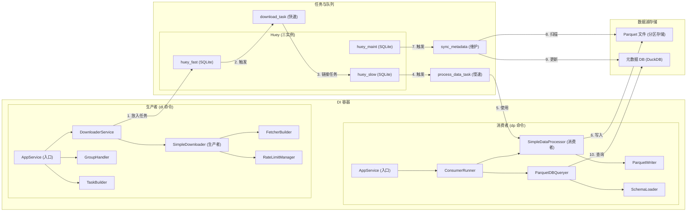

# 核心架构分析

本文档详细描述了 `stock_downloader` 项目在经过**数据湖架构演进**后的核心架构、主要组件及其交互方式。

## 1. 架构风格

本项目采用了三种核心架构风格的组合：

1.  **依赖注入 (Dependency Injection, DI)**: 通过 `dependency-injector` 库实现，遵循**控制反转 (Inversion of Control, IoC)** 原则。
    - **中心化容器**: 应用的核心是 `AppContainer` (`src/neo/containers.py`)，它负责实例化和管理所有服务的生命周期。
    - **松耦合**: 组件不直接创建依赖，而是由容器注入。这使得代码更易于测试、维护和扩展。

2.  **生产者-消费者模式 (Producer-Consumer)**: 项目通过**隔离的任务队列 (Task Queue)** 将下载流程（生产者）与数据处理流程（消费者）完全解耦，解决了原有的性能瓶颈。
    - **三队列隔离**: 系统采用三个独立的 Huey 实例，将不同类型的任务隔离执行：
        - **`huey_fast` (快速队列)**: 用于处理高并发、耗时短的I/O密集型任务（如API数据下载），配置大量 `workers` 以最大化吞吐量。
        - **`huey_slow` (慢速队列)**: 用于处理耗时长、有阻塞的磁盘I/O任务（如数据处理和文件写入），配置为**单 `worker`** 运行，以避免并发写入冲突。
        - **`huey_maint` (维护队列)**: 用于处理低频的维护任务（如元数据同步），独立运行，不影响主数据流。
    - **异步处理**: 下载器 (`dl` 命令) 作为生产者，将下载任务放入**快速队列**。任务完成后，再将后续的数据处理任务推入**慢速队列**。
    - **可靠性与扩展性**: 任务队列提高了系统的可靠性。通过隔离快慢任务，系统整体性能不再受限于最慢的环节。

3.  **数据湖架构 (Data Lake Architecture)**: 项目采用现代数据湖架构，将数据存储与计算分离。
    - **Parquet 数据湖**: 使用 Parquet 列式存储格式作为主要数据存储，支持高效的分析查询和压缩。
    - **元数据管理**: 通过 DuckDB 管理 Parquet 文件的元数据，提供统一的 SQL 查询接口。
    - **分区存储**: 按时间等维度对数据进行分区，优化查询性能和数据管理。

## 2. 核心组件详解

### 组件职责列表

#### 生产者组件
-   **`AppService` (Singleton)**: **应用顶层服务**，作为CLI命令的入口和协调器，驱动生产者 (`dl`) 和消费者 (`dp`) 的执行。
-   **`DownloaderService` (Singleton)**: **下载服务**，负责将下载任务提交到快速队列，协调整个下载流程。
-   **`GroupHandler` (Singleton)**: **任务组处理器**，解析 `config.toml` 中定义的任务组，方便用户批量执行。
-   **`TaskBuilder` (Singleton)**: **任务构建器**，根据用户输入的参数构建具体的下载任务对象。
-   **`SimpleDownloader` (Singleton)**: **核心下载器**，使用 `FetcherBuilder` 获取数据，专注于数据获取逻辑。
-   **`FetcherBuilder` (Factory)**: **数据获取器工厂**，根据任务类型创建对应的数据获取器 (Fetcher)，负责从外部API抓取数据。
-   **`RateLimitManager` (Singleton)**: **速率管理器**，全局单例，对API请求进行速率限制。

#### 消费者组件
-   **`ConsumerRunner` (Singleton)**: **消费者运行器**，负责启动和管理队列消费者进程，协调消费者的执行。
-   **`SimpleDataProcessor` (Factory)**: **数据处理器 (消费者)**，在后台任务中运行，对原始数据进行清洗、转换。
-   **`ParquetWriter` (Factory)**: **Parquet 文件写入器**，负责将处理后的数据写入 Parquet 文件，实现数据持久化。
-   **`ParquetDBQueryer` (Singleton)**: **Parquet 数据查询器**，负责查询 Parquet 文件的元数据，提供统一的查询接口。
-   **`SchemaLoader` (Singleton)**: **表结构加载器**，从 `stock_schema.toml` 加载表结构信息，供数据处理组件使用。

#### 任务队列
-   **Huey (三实例, Framework)**: **任务队列中间件**。`huey_fast`、`huey_slow` 和 `huey_maint` 三个实例，分别管理下载、数据处理和维护任务。
-   **`download_task` (Huey Task)**: **下载任务 (快速)**，在 `huey_fast` 中高并发执行。负责从API下载原始数据，完成后调用 `process_data_task` 将数据送入慢速队列。
-   **`process_data_task` (Huey Task)**: **数据处理任务 (慢速)**，在 `huey_slow` 中**单线程**执行。调用 `SimpleDataProcessor` 完成数据处理和 Parquet 文件写入。
-   **`sync_metadata` (Huey Task)**: **元数据同步任务 (维护)**，在 `huey_maint` 中执行。负责扫描 Parquet 文件并更新元数据数据库。

#### 数据湖存储
-   **Parquet 文件**: **分区存储的数据文件**，按日期和表名组织，提供高效的列式存储和压缩。
-   **元数据 DB (DuckDB)**: **元数据数据库**，存储 Parquet 文件的元数据和索引信息，提供统一的 SQL 查询接口。

#### 容器管理
-   **`AppContainer` (Container)**: **DI容器**，定义并管理所有应用服务的生命周期和依赖关系。

> [!IMPORTANT]
> 为保证项目依赖环境的一致性，所有与 Python 相关的命令都应通过 `uv run` 来执行。

## 3. 核心逻辑流程

应用的执行流程被清晰地分为两个独立的、通过任务队列链接的阶段。

### 阶段 1: 生产下载任务 (执行 `dl` 命令)

1.  **启动**: 用户执行 `uv run dl --group <group_name>`。
2.  **构建任务**: `GroupHandler` 和 `TaskBuilder` 准备好要执行的下载任务列表。
3.  **执行下载**: `AppService` 调用 `DownloaderService` 来执行下载。
4.  **入队 (Enqueue) 到快速队列**: `DownloaderService` 为每个下载请求调用 `download_task`。Huey 将这些任务放入**快速队列 (`huey_fast`)**。`dl` 命令本身迅速执行完毕。

### 阶段 2: 消费任务 (执行 `dp` 命令)

1.  **启动消费者**: 用户在另一终端通过 `run_dp_and_monitor.sh` 脚本或手动执行 `uv run dp --queue fast` 和 `uv run dp --queue slow`，同时启动两个队列的消费者进程。
2.  **消费快速队列 (下载)**:
    - `fast` 队列的消费者（高并发）从队列中取出 `download_task`。
    - 任务执行，从外部API获取数据。
    - **链接任务**: 下载成功后，任务调用 `process_data_task`，将获取到的原始数据作为参数，**放入慢速队列 (`huey_slow`)**。
3.  **消费慢速队列 (数据处理)**:
    - `slow` 队列的消费者（单线程）从队列中取出 `process_data_task`。
    - 任务调用 `SimpleDataProcessor` 对数据进行清洗、转换。
    - `ParquetWriter` 将处理后的干净数据写入分区的 Parquet 文件。由于是单线程执行，**避免了任何文件写入冲突**。
4.  **维护队列处理**:
    - `sync_metadata` 任务定期在 `huey_maint` 队列中执行。
    - 扫描 Parquet 文件目录，更新元数据数据库中的文件索引信息。
    - 维护数据湖的一致性和可查询性。

## 数据流转

### 完整流程

1. **用户执行 `dl` 命令**
   - `AppService` 初始化 DI 容器
   - `TaskBuilder` 根据参数构建任务列表
   - `DownloaderService` 将任务提交到快速队列

2. **快速队列处理 (`huey_fast`)**
   - `download_task` 使用 `SimpleDownloader` 和 `FetcherBuilder` 获取数据
   - 原始数据暂存到临时位置
   - 链接调用 `process_data_task`，将任务转移到慢速队列

3. **慢速队列处理 (`huey_slow`)**
   - `process_data_task` 调用 `SimpleDataProcessor`
   - `SimpleDataProcessor` 进行数据清洗和转换
   - `ParquetWriter` 将数据写入分区的 Parquet 文件
   - 清理临时文件

4. **维护队列处理 (`huey_maint`)**
   - `sync_metadata` 定期扫描 Parquet 文件目录
   - 更新元数据数据库中的文件索引信息
   - 维护数据湖的一致性和可查询性

5. **用户执行 `dp` 命令**
   - `AppService` 通过 `ConsumerRunner` 启动消费者进程
   - 消费者持续监听队列，处理积压任务
   - `ParquetDBQueryer` 提供数据查询能力

通过这种方式，系统实现了下载和数据处理的完全解耦，高并发的下载任务不再被缓慢的数据写入所阻塞。

## 4. 性能分析与结论

### 4.1 性能优势

1. **下载性能提升**:
   - 快速队列支持高并发（默认 10 个工作进程）
   - 下载任务不再等待数据写入完成
   - API 调用频率得到充分利用

2. **数据处理稳定性**:
   - 慢速队列单线程执行，避免文件写入竞争
   - 数据处理失败不影响下载任务继续执行
   - 支持任务重试和错误恢复

3. **存储性能优化**:
   - Parquet 列式存储提供高压缩比和查询性能
   - 分区存储支持高效的数据过滤和访问
   - 元数据索引加速数据发现和查询

4. **资源利用优化**:
   - 网络 I/O 和磁盘 I/O 操作完全分离
   - 系统资源得到更合理的分配
   - 支持独立的性能调优和扩展

### 4.2 架构演进解决的瓶颈

- **原瓶颈：资源争抢**
  - **问题**: 所有任务（无论快慢）在同一个消费者中执行，导致高并发的下载任务必须等待缓慢的数据写入任务完成，严重限制了系统吞吐量。
  - **解决方案**: 采用**三队列架构**，将快慢任务彻底隔离。下载任务在快速队列中可以达到其API速率上限，而数据写入在慢速队列中稳定执行。

- **原瓶颈：文件并发写入**
  - **问题**: 多进程同时写入 Parquet 文件会导致文件锁竞争和IO错误。
  - **解决方案**:
    1.  将所有文件写入操作从高并发的 `download_task` 中移除。
    2.  将处理数据写入的**慢速队列消费者严格限制为单线程 (`max_workers = 1`)**。

### 4.3 最终结论

当前的**多队列数据湖架构**成功解决了旧架构的性能瓶颈。通过将下载（I/O密集型）和数据处理（磁盘密集型）这两个不同性质的操作分离到独立的队列中，系统实现了：

- **高性能**: 下载速度不再受数据写入速度的限制，能够充分利用网络和API资源。
- **高稳定性**: 通过强制单线程写入，彻底杜绝了文件写入层面的并发冲突，保证了数据处理的可靠性。
- **高扩展性**: 采用 Parquet 列式存储和分区策略，支持高效的分析查询和数据管理。
- **统一查询**: 通过 DuckDB 元数据管理，提供统一的 SQL 查询接口访问数据湖。
- **现代化存储**: 数据湖架构支持大规模数据存储和分析，为未来的数据科学应用奠定基础。

该架构清晰、健壮，且性能表现符合预期。
