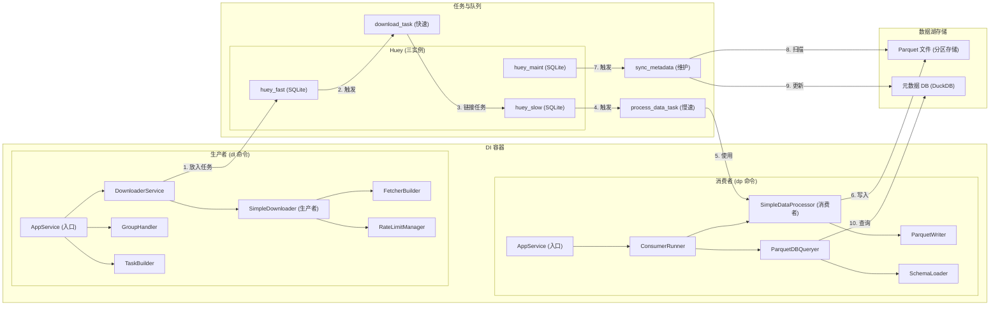

# 核心架构分析

本文档详细描述了 `stock_downloader` 项目在经过**数据湖架构演进**后的核心架构、主要组件及其交互方式。

## 1. 架构风格

本项目采用了三种核心架构风格的组合：

1.  **依赖注入 (Dependency Injection, DI)**: 通过 `dependency-injector` 库实现，遵循**控制反转 (Inversion of Control, IoC)** 原则。
    - **中心化容器**: 应用的核心是 `AppContainer` (`src/neo/containers.py`)，它负责实例化和管理所有服务的生命周期。
    - **松耦合**: 组件不直接创建依赖，而是由容器注入。这使得代码更易于测试、维护和扩展。

2.  **生产者-消费者模式 (Producer-Consumer)**: 项目通过**隔离的任务队列 (Task Queue)** 将下载流程（生产者）与数据处理流程（消费者）完全解耦，解决了原有的性能瓶颈。
    - **三队列隔离**: 系统采用三个独立的 Huey 实例，将不同类型的任务隔离执行：
        - **`huey_fast` (快速队列)**: 用于处理高并发、耗时短的I/O密集型任务（如API数据下载），配置大量 `workers` 以最大化吞吐量。
        - **`huey_slow` (慢速队列)**: 用于处理耗时长、有阻塞的磁盘I/O任务（如数据处理和文件写入），配置为**单 `worker`** 运行，以避免并发写入冲突。
        - **`huey_maint` (维护队列)**: 用于处理低频的维护任务（如元数据同步），独立运行，不影响主数据流。
    - **异步处理**: 下载器 (`dl` 命令) 作为生产者，将下载任务放入**快速队列**。任务完成后，再将后续的数据处理任务推入**慢速队列**。
    - **可靠性与扩展性**: 任务队列提高了系统的可靠性。通过隔离快慢任务，系统整体性能不再受限于最慢的环节。

3.  **数据湖架构 (Data Lake Architecture)**: 项目采用现代数据湖架构，将数据存储与计算分离。
    - **Parquet 数据湖**: 使用 Parquet 列式存储格式作为主要数据存储，支持高效的分析查询和压缩。
    - **元数据管理**: 通过 DuckDB 管理 Parquet 文件的元数据，提供统一的 SQL 查询接口。
    - **分区存储**: 按 **`year` (年份)** 对数据进行分区，有效避免了因每日分区导致的海量“小文件问题”，显著提升了查询性能。分区键 `year` 由 `SimpleDataProcessor` 在数据写入前动态添加。

## 2. 核心组件详解



### 组件职责列表

#### 生产者组件
-   **`AppService` (Singleton)**: **应用顶层服务**，作为CLI命令的入口和协调器，驱动生产者 (`dl`) 和消费者 (`dp`) 的执行。
-   **`DownloaderService` (Singleton)**: **下载服务**，负责将下载任务提交到快速队列，协调整个下载流程。
-   **`GroupHandler` (Singleton)**: **任务组处理器**，解析 `config.toml` 中定义的任务组，方便用户批量执行。
-   **`TaskBuilder` (Singleton)**: **任务构建器**，根据用户输入的参数构建具体的下载任务对象。
-   **`SimpleDownloader` (Singleton)**: **核心下载器**，使用 `FetcherBuilder` 获取数据，专注于数据获取逻辑。
-   **`FetcherBuilder` (Factory)**: **数据获取器工厂**，根据任务类型创建对应的数据获取器 (Fetcher)，负责从外部API抓取数据。
-   **`RateLimitManager` (Singleton)**: **速率管理器**，全局单例，对API请求进行速率限制。

#### 消费者组件
-   **`ConsumerRunner` (Singleton)**: **消费者运行器**，负责启动和管理队列消费者进程，协调消费者的执行。
-   **`SimpleDataProcessor` (Factory)**: **数据处理器 (消费者)**，在后台任务中运行，对原始数据进行清洗、转换，并动态添加 `year` 分区键。
-   **`ParquetWriter` (Factory)**: **Parquet 文件写入器**，负责将处理后的数据按 `year` 分区写入 Parquet 文件。
-   **`ParquetDBQueryer` (Singleton)**: **Parquet 数据查询器**，负责查询 Parquet 文件的元数据，提供统一的查询接口。
-   **`SchemaLoader` (Singleton)**: **表结构加载器**，从 `stock_schema.toml` 加载表结构信息，供数据处理组件使用。

#### 任务队列
-   **`build_and_enqueue_downloads_task` (Huey Task)**: **智能增量下载的规划任务**，运行在**慢速队列**。它负责查询数据湖中每项数据的最新日期，计算出需要下载的增量范围，然后将具体的 `download_task` 派发到快速队列。
-   **`download_task` (Huey Task)**: **下载任务 (快速)**，在 `huey_fast` 中高并发执行。负责从API下载原始数据，完成后调用 `process_data_task` 将数据送入慢速队列。
-   **`process_data_task` (Huey Task)**: **数据处理任务 (慢速)**，在 `huey_slow` 中**单线程**执行。调用 `SimpleDataProcessor` 完成数据处理和 Parquet 文件写入。
-   **`sync_metadata` (Huey Task)**: **元数据同步任务 (维护)**，在 `huey_maint` 中执行。负责扫描 Parquet 文件并更新元数据数据库。

#### 数据湖存储
-   **Parquet 文件**: **按 `year` 分区存储的数据文件**，提供高效的列式存储和压缩。
-   **元数据 DB (DuckDB)**: **元数据数据库** (`data/metadata.db`)，存储 Parquet 文件的元数据和索引信息，是查询的入口。

#### 容器管理
-   **`AppContainer` (Container)**: **DI容器**，定义并管理所有应用服务的生命周期和依赖关系。

> [!IMPORTANT]
> 为保证项目依赖环境的一致性，所有与 Python 相关的命令都应通过 `uv run` 来执行。

## 3. 核心逻辑流程

应用的执行流程被清晰地分为两个独立的、通过任务队列链接的阶段。

### 阶段 1: 智能增量生产下载任务 (执行 `dl` 命令)

这是实现增量更新的核心，它并非盲目下载，而是“先查询，再下载”。

1.  **启动**: 用户执行 `uv run dl --group <group_name>`，触发 `build_and_enqueue_downloads_task` 任务。
2.  **查询本地数据**: 任务首先通过 `ParquetDBQueryer` 查询数据湖，获取**每支股票、每种数据**的**最新日期**。
3.  **计算增量范围**:
    - 如果某项数据已存在，则将下载的起始日期（`start_date`）设置为**已有数据的后一天**。
    - 如果数据完全不存在，则使用配置文件中的默认起始日期。
    - 同时，任务会判断是否需要跳过（例如，当天数据已下载或未到收盘时间），避免无效请求。
4.  **入队 (Enqueue) 到快速队列**: 任务为每个计算出的增量范围生成一个具体的 `download_task`，并将其放入**快速队列 (`huey_fast`)**。`dl` 命令本身迅速执行完毕。

### 阶段 2: 消费任务 (执行 `dp` 命令)

1.  **启动消费者**: 用户在另一终端通过 `run_dp_and_monitor.sh` 脚本或手动执行 `uv run dp --queue fast` 和 `uv run dp --queue slow`，同时启动两个队列的消费者进程。
2.  **消费快速队列 (下载)**:
    - `fast` 队列的消费者（高并发）从队列中取出 `download_task`。
    - 任务执行，从外部API获取**增量数据**。
    - **链接任务**: 下载成功后，任务调用 `process_data_task`，将获取到的原始数据作为参数，**放入慢速队列 (`huey_slow`)**。
3.  **消费慢速队列 (数据处理与写入)**:
    - `slow` 队列的消费者（单线程）从队列中取出 `process_data_task`。
    - 任务调用 `SimpleDataProcessor` 对数据进行清洗，并**动态添加 `year` 分区列**。
    - `ParquetWriter` 将处理后的干净数据写入**按 `year` 分区**的 Parquet 文件。由于是单线程执行，**避免了任何文件写入冲突**。
    - **冲突处理**: 写入行为被设置为 `overwrite_or_ignore`。这意味着在极少数情况下（如手动重复执行任务），如果新下载的数据与现有分区重叠，**整个分区将被新数据覆盖**，以此作为保证数据一致性的最终防线。
4.  **维护队列处理**:
    - `sync_metadata` 任务定期在 `huey_maint` 队列中执行。
    - 扫描 Parquet 文件目录，更新元数据数据库中的文件索引信息。
    - 维护数据湖的一致性和可查询性。

## 4. 性能分析与结论

### 4.1 性能优势

1. **下载性能提升**:
   - 快速队列支持高并发，API 调用频率得到充分利用。
   - 智能增量逻辑避免了不必要的重复下载。

2. **数据处理稳定性**:
   - 慢速队列单线程执行，避免文件写入竞争。
   - 分区覆盖策略保证了数据一致性。

3. **存储与查询性能优化**:
   - Parquet 列式存储提供高压缩比。
   - **按年分区**的策略有效解决了“小文件问题”，大幅提升了分析查询的性能。
   - 元数据索引加速数据发现和查询。

### 4.2 架构演进解决的瓶颈

- **原瓶颈：资源争抢与重复下载**
  - **解决方案**: 采用**三队列架构**隔离快慢任务，并引入**智能增量下载**逻辑。

- **原瓶颈：文件并发写入与小文件问题**
  - **解决方案**:
    1.  将所有文件写入操作移至**单线程的慢速队列**。
    2.  采用**按年分区**策略，将细碎的每日数据聚合成年度文件。

### 4.3 最终结论

当前的**多队列数据湖架构**成功解决了旧架构的性能瓶颈，实现了高性能、高稳定性、高扩展性和统一查询的现代化数据平台。

## 5. 数据查询范式

本架构遵循“存算分离”原则，查询操作通过 `DuckDB` 在需要时直接对文件系统中的 Parquet 数据湖进行，无需启动常驻的数据库服务。

### 5.1 查询机制

1.  **查询引擎**: **DuckDB** 作为嵌入式OLAP数据库，是本项目的核心查询引擎。
2.  **元数据中心**: 项目根目录下的 `data/metadata.db` 文件是查询的**唯一入口**。它不存储任何海量数据，只存储所有数据表的**模式（Schema）**和**文件清单（File Manifest）**。
3.  **查询流程**:
    - 查询工具连接到 `metadata.db` 文件。
    - 用户提交 SQL 查询。
    - DuckDB 解析 SQL，根据元数据中的文件清单，定位到需要读取的一个或多个 Parquet 文件。
    - DuckDB 直接读取这些 Parquet 文件，完成计算，并返回结果。

### 5.2 实战工具：`query_parquet_data.py`

项目提供了一个位于 `scripts/` 目录下的命令行工具 `query_parquet_data.py`，用于执行数据查询。该工具经过改造后，支持通过 `--sql` 参数执行任意复杂的SQL查询。

#### 查询示例

例如，查询贵州茅台（600519）过去10年的净利润，可执行以下命令：

```bash
uv run python scripts/query_parquet_data.py --sql "SELECT end_date, n_income FROM income_statement WHERE ts_code = '600519.SH' AND year >= '2015' ORDER BY end_date DESC"
```

- **`uv run ...`**: 通过 `uv` 运行查询脚本。
- **`--sql "..."`**: 传入一段完整的SQL语句。
- **SQL语句**:
  - `FROM income_statement`: 指定查询利润表。
  - `WHERE ts_code = '600519.SH'`: 按标准股票代码过滤。
  - `AND year >= '2015'`: 利用分区键 `year` 高效地进行时间范围过滤。
  - `ORDER BY end_date DESC`: 按财报截止日期降序排列。

这种查询方式充分利用了 DuckDB 和 Parquet 分区带来的性能优势，实现了对本地数据湖的即时、高效分析。
